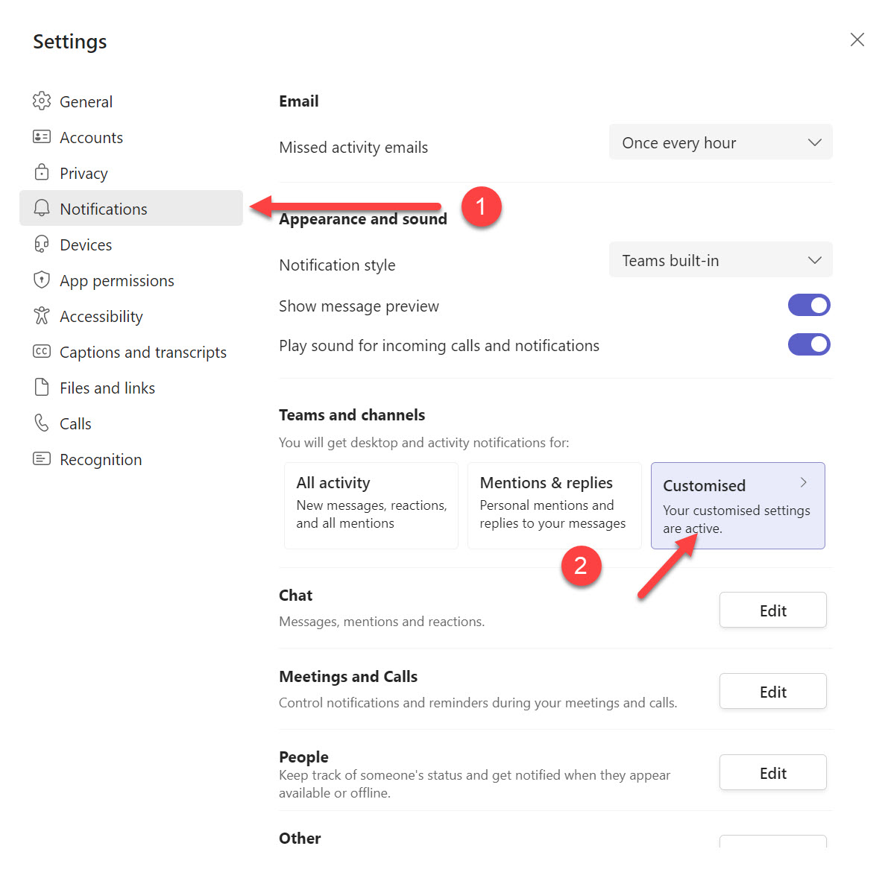

[Dealing with distractions](/do-you-deal-with-distractions) is a fundamental rule to a successful project. Microsoft Teams is a great way to get distracted. Following these options helps you to minimize message distractions:

1.  Turn on at start-up - With the application always on your desktop, there is no reason for alerts to be sent to your email or phone
2. Disable email alerts - this reduces bloat in your [task list](/dones-is-your-inbox-a-task-list-only)

<!--endintro-->

