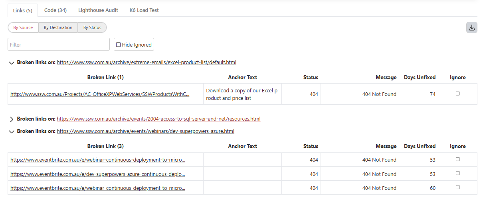

Often times, web pages are dynamic. Most link scanners are not capable of submitting form information. The trick is to allow a "door" for link scanner go through to scan a dynamic section of a site. A common technique is to hard code hidden link with a query string at the bottom of the page that allows the link scanner to follow into the simulated user input. See the following code for example:

<!--endintro-->

```html
<a href="KB.aspx?KBID=Q1097707"
  >Q1097707 - How do I turn Option Strict on by default in VB.NET?</a
>
```

**Figure: Example source code - finding broken links**


It will return all the knowledge base articles in a paged format. The link scanner will click the Next Page link and eventually scan through the entire knowledge base.

### Google Webmaster & Bing Webmaster

[Google webmaster tools](https://www.google.com/webmasters) and [Bing webmaster centre](http://www.bing.com/toolbox/webmaster/) are useful tools to monitor links.

::: good

:::


### SSW Link Auditor

We have a program called [SSW Link Auditor](https://sswlinkauditor.com/) to check for this rule.
::: good

:::

### SSW CodeAuditor

Identifying where you have broken links on your website can be a little like finding a needle in a haystack. For enterprise scale web applications with lots of moving parts, it feels more like finding a penny at the bottom of the ocean.

SSW CodeAuditor is a cheap, convenient tool for hunting down broken links, and you don't need a sitemap to set it up. Just point it at a publicly accessible URL and it'll spit out a report.

* Broken links are categorized by page making them easy to fix
* Each broken link listing includes a status code to tell you what went wrong
* Broken Links in the dashboard are displayed with their corresponding anchor text to give you some context about the page
* It can be implemented with you website's Continuous Integration pipeline to automate link auditing

::: good

:::
