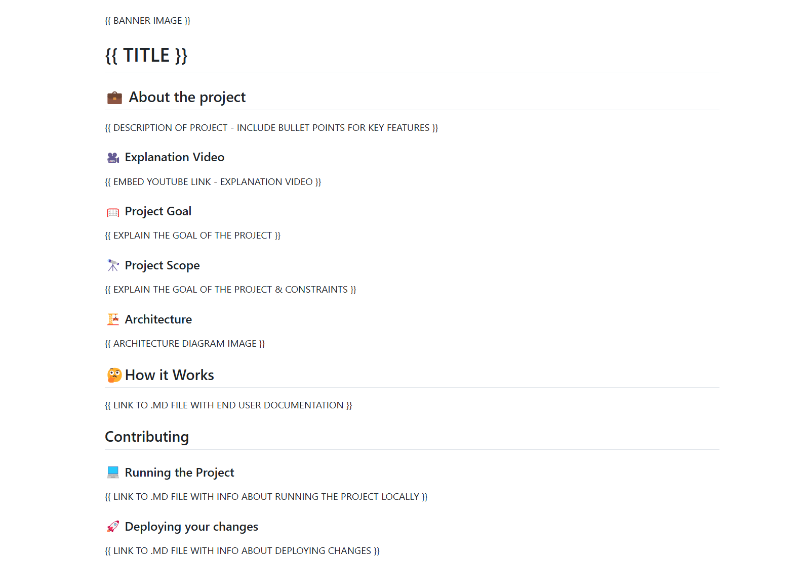

A README can often be a potential contributor's first impression of your project. It communicates the project's vision, how to contribute to the project and places where people can donate and installation instructions.

<!--endintro-->

Having a README template ensures that you’re checking all of the boxes for ensuring that contributors have an easy time getting your project up and running and beneficiaries know how to use your code.

README templates can be beneficial for ensuring your personal projects have the features necessary for gaining momentum and ensuring that projects done at an organizational level are up to a high standard.

::: bad

:::

This README is very basic, the setup instructions are limited and there is room for improvement:

- Bullet points could help better communicate selling points
- Diagrams
- Photos and marketing material
- Multiple level headings
- Known Issues

::: good

:::

It's important to keep your README templates in a convenient place to ensure that you can quickly bootstrap a project when you get started.

## What does an awesome README template look like?

The ideal README should foster contributions for a project organically. It should provide all the relevant information a contributor user would need to get the project up and
running, make code changes, and deploy to production if necessary. It should also contain a number of clearly located social media links so followers of the project
users can keep an ear to the ground for updates. Followers who see regular updates via social media are more likely to feel actively involved and will commit to the project's success.

We've created a README template with placeholders where you can add all of the relevant information for your project to ensure that it's a success. Bear in mind that not all of
the information listed will be relevant to your particular project. For instance, closed-source projects more than likely won't contain social media or sponsorship links. Feel free to remove any placeholders that aren't relevant to your project. 

You can find the template here on GitHub [GitHub](https://github.com/SSWConsulting/SSW.AwesomeReadme.Template/blob/main/readme-template.md)

::: good

:::
